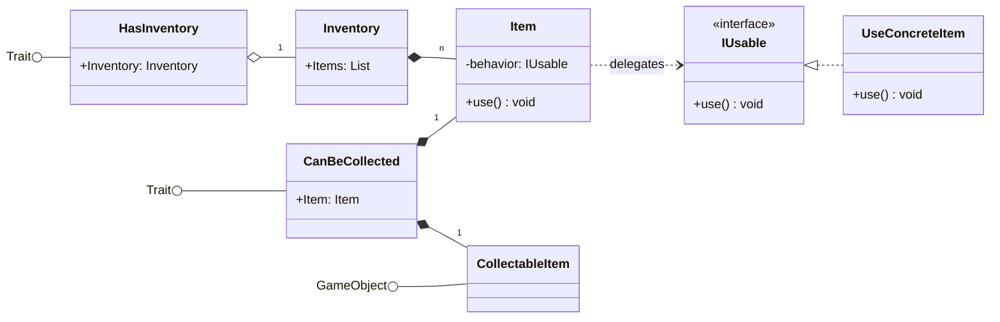

	

  <h1 align="center">Hmk Engine</h1>
  
<strong>Hmk Engine</strong> is a 2D Game Engine created with C# and Raylib

# Inventory System

```mermaid
classDiagram
direction LR

class IUsable  {
    <<interface>>
    +use() void
}

class UseConcreteItem {
    +use() void
}

class Item {
    -behavior: IUsable
    +use() void
}


class Inventory {
    +Items: List<Item>
}

class HasInventory {
    +Inventory: Inventory
}

class CollectableItem

class CanBeCollected{
+Item: Item
}


IUsable <|.. UseConcreteItem
Item ..> IUsable : delegates
HasInventory o-- "1" Inventory
Inventory *-- "n" Item

CanBeCollected *-- "1" Item
CanBeCollected *-- "1" CollectableItem
Trait ()-- HasInventory
Trait ()-- CanBeCollected
GameObject ()-- CollectableItem
```
