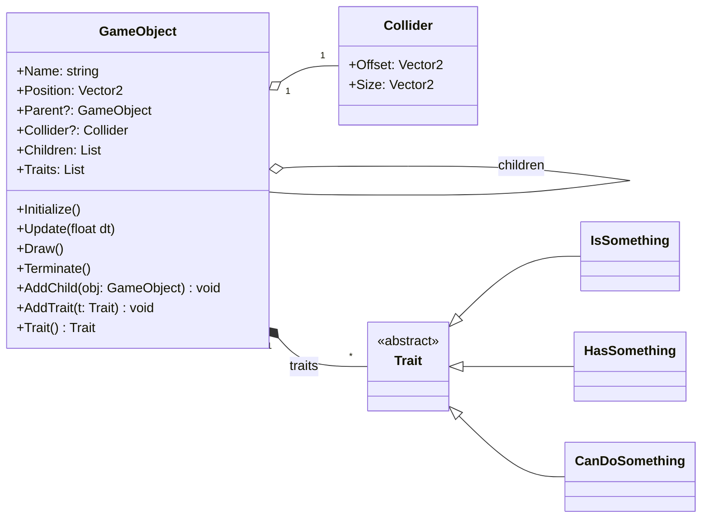
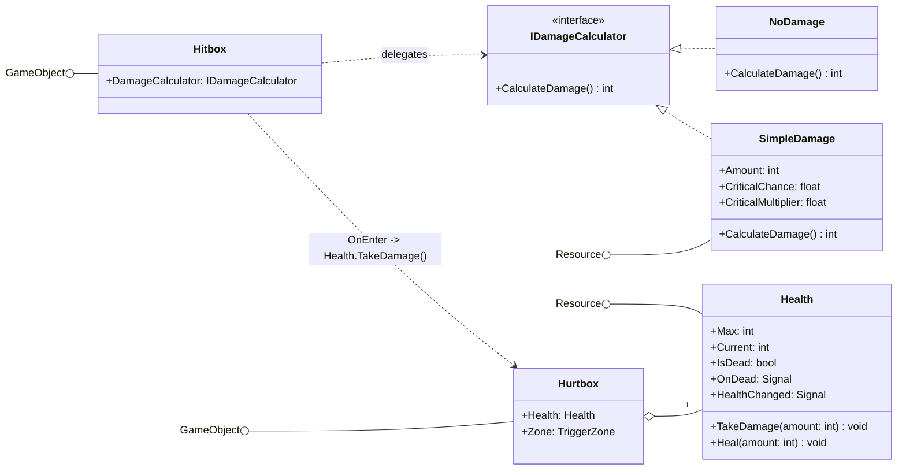
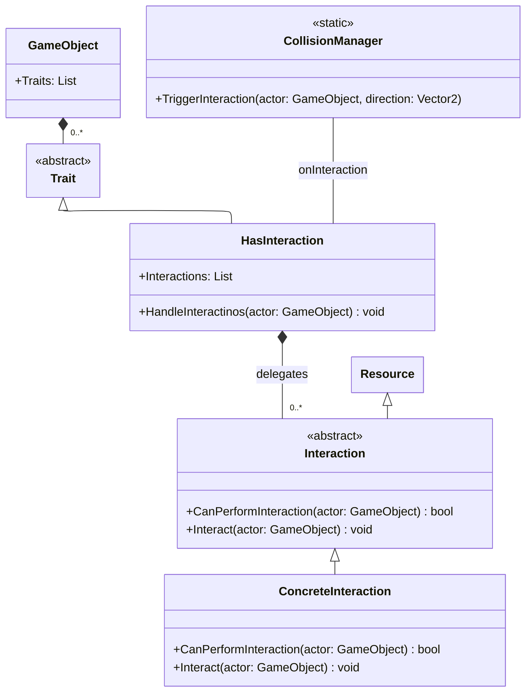
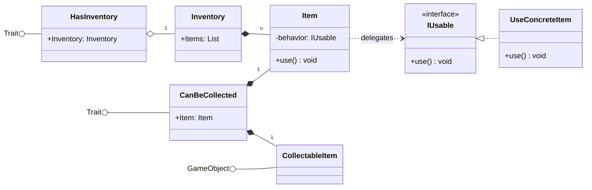

## Game Object Architecture

```mermaid
classDiagram
direction LR

class GameObject {
    +Name: string
    +Position: Vector2
    +Parent?: GameObject
    +Collider?: Collider
    +Initialize()
    +Update(float dt)
    +Draw()
    +Terminate()

    +Children: List<GameObject>
    +Traits: List<Trait>
    +AddChild(obj: GameObject) void
    +AddTrait(t: Trait) void
    +Trait<T>() Trait
}

class Collider{
    +Offset: Vector2
    +Size: Vector2
}

class Trait {
    <<abstract>>
}

GameObject  o-- GameObject : children
GameObject  "1" o-- "1" Collider
GameObject "1" *-- "*" Trait : traits


Trait <|-- IsSomething
Trait <|-- HasSomething
Trait <|-- CanDoSomething
```

## Attack System

```mermaid
classDiagram
direction LR

class Hurtbox {
    +Health: Health
    +Zone: TriggerZone
}

class IDamageCalculator {
    <<interface>>
    +CalculateDamage() int
}

class NoDamage {
    +CalculateDamage() int
}

class SimpleDamage {
    +Amount: int
    +CriticalChance: float
    +CriticalMultiplier: float
    +CalculateDamage() int
}


class Hitbox {
    +DamageCalculator: IDamageCalculator
}

Resource ()-- Health
Hitbox ..> IDamageCalculator : delegates
GameObject ()-- Hitbox

Hurtbox o-- "1" Health
Hitbox ..> Hurtbox : OnEnter -> Health.TakeDamage()


GameObject ()-- Hurtbox


class Health {
    +Max: int
    +Current: int
    +IsDead: bool
    +OnDead: Signal
    +HealthChanged: Signal
    +TakeDamage(amount: int) void
    +Heal(amount: int) void
}

IDamageCalculator <|.. NoDamage
IDamageCalculator <|.. SimpleDamage

Resource ()-- SimpleDamage
```

## Interaction System

```mermaid
---
config:
  layout: elk
  class:
    hideEmptyMembersBox: true
---
classDiagram
direction TB
    class Interaction {
	    +CanPerformInteraction(actor: GameObject) bool
	    +Interact(actor: GameObject) void
    }
    class ConcreteInteraction {
	    +CanPerformInteraction(actor: GameObject) bool
	    +Interact(actor: GameObject) void
    }
    class HasInteraction {
	    +Interactions: List
	    +HandleInteractinos(actor: GameObject) void
    }
    class GameObject {
	    +Traits: List
    }
    class Trait {
    }
    class CollisionManager {
	    +TriggerInteraction(actor: GameObject, direction: Vector2)
    }
    class Resource {
    }

	<<abstract>> Interaction
	<<abstract>> Trait
	<<static>> CollisionManager

    Interaction <|-- ConcreteInteraction
    Trait <|-- HasInteraction
    HasInteraction *-- "0..*" Interaction : delegates
    GameObject *-- "0..*" Trait
    CollisionManager -- HasInteraction : onInteraction
    Resource <|-- Interaction

```

## Inventory System

```mermaid
classDiagram
direction LR

class IUsable  {
    <<interface>>
    +use() void
}

class UseConcreteItem {
    +use() void
}

class Item {
    -behavior: IUsable
    +use() void
}


class Inventory {
    +Items: List<Item>
}

class HasInventory {
    +Inventory: Inventory
}

class CollectableItem

class CanBeCollected{
+Item: Item
}


IUsable <|.. UseConcreteItem
Item ..> IUsable : delegates
HasInventory o-- "1" Inventory
Inventory *-- "n" Item

CanBeCollected *-- "1" Item
CanBeCollected *-- "1" CollectableItem
Trait ()-- HasInventory
Trait ()-- CanBeCollected
GameObject ()-- CollectableItem
```
